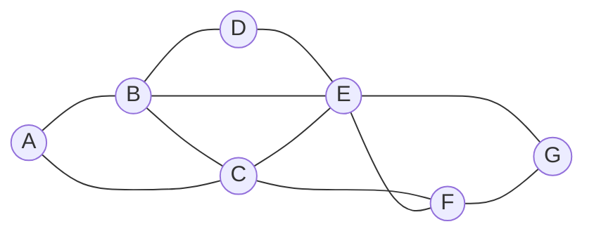

## Definition

- An instance of [[Depth-First Search|DFS]] that uses less memory (only $O(m)$ is required)
- Only one successor is generated at a time
- Additionally, state description can be generated through modifications rather than copying
- A type of a search algorithm that takes into account the structure of a [[constraint satisfaction]] search problem
- A recursive function that attempts to continue assigning values as long as they satisfy the constraints
- If constraints are violated, it tries a different assignment

## Examples

> Using [[Constraint Satisfaction#Examples|example from Constraint Satisfaction]] for explanation



> State 0
> ```
> A: {Mon, Tue, Wed}
> B: {Mon, Tue, Wed}
> C: {Mon, Tue, Wed}
> D: {Mon, Tue, Wed}
> E: {Mon, Tue, Wed}
> F: {Mon, Tue, Wed}
> G: {Mon, Tue, Wed}
> ```

> State 1
> ```
> A: Mon
> B: {Mon, Tue, Wed}
> C: {Mon, Tue, Wed}
> D: {Mon, Tue, Wed}
> E: {Mon, Tue, Wed}
> F: {Mon, Tue, Wed}
> G: {Mon, Tue, Wed}
> ```

> State 2
> ```
> A: Mon
> B: Mon
> C: {Mon, Tue, Wed}
> D: {Mon, Tue, Wed}
> E: {Mon, Tue, Wed}
> F: {Mon, Tue, Wed}
> G: {Mon, Tue, Wed}
> ```

> State 3
> ```
> A: Mon
> B: Tue
> C: {Mon, Tue, Wed}
> D: {Mon, Tue, Wed}
> E: {Mon, Tue, Wed}
> F: {Mon, Tue, Wed}
> G: {Mon, Tue, Wed}
> ```

1. Start with empty assignments (state 0)
2. Choose `A` and assign to it some value (state 1)
3. Using this assignment, run the algorithm again
4. Consider `B` and assign `Mon` to it (state 2)
5. This assignment returns false
6. The algorithm tries to assign a new value `Tue` to `B` (state 3)
7. This new assignment satisfies the constraints
8. A new variable will be considered next given this assignment

## Improving efficiency

- Interleaving backtracking search with inference (enforcing [[arc consistency]])
	- Although backtracking search is more efficient than simple [[search]], it still takes a lot of computational power
	- Enforcing arc consistency, on the other hand, is less resource intensive
- Use of [[heuristic]]
	- Instead of selecting an unassigned variable randomly
	- Some choices are more likely to bring to a solution faster than others
	- For `Select-Unassigned-Var()`: [[minimum remaining values]], [[degree]]
	- For `Domain-Values()`: [[least constraining values]]

## Pseudocode

### Naive approach

```
BACKTRACK(assignment, csp):
  if assignment complete:
    return assignment
  var = Select-Unassigned-Var(assignment, csp)
  for value in Domain-Values(var, assignment, csp):
    if value consistent with assignment:
	  add {var = value} to assignment
	  result = BACKTRACK(assignment, csp)
	  if result != failure:
	    return result
	  remove {var = value} from assignment
  return failure
```

- If the assignment is complete, it will not perform any of the additional actions
- If the assignment is not complete, the algorithm selects any of the variables that do not have an assignment yet and tries to assign a value to the variable
- Runs the Backtrack algorithm again on the resulting assignment
	- checks the resulting value
	- If it is not failure, it means that the assignment worked out
	- If the resulting value is failure, then the latest assignment is removed, and a new possible value is attempted, repeating the same process
- If all possible values in the domain returned failure, this means that we need to backtrack
	- The problem is with some previous assignment
- If this happens with the variable we start with, then it means that no solution satisfies the constraints

### Maintaining arc consistency

```
BACKTRACK(assignment, csp):
  if assignment complete:
    return assignment
  var = Select-Unassigned-Var(assignment, csp)
  for value in Domain-Values(var, assignment, csp):
    if value consistent with assignment:
	  add {var = value} to assignment
	  inferences = INFERENCE(assignment, csp)
	  if inferences != failure:
	    add inferences to assignment
	  result = BACKTRACK(assignment, csp)
	  if result != failure:
	    return result
	  remove {var = value} and inferences from assignment
  return failure
```

- Enforce arc-consistency after every new assignment of the backtracking search
- After we make a new assignment to `X`, we will call the `AC-3` algorithm and start it with a queue of all arcs `(Y,X)` where `Y` is a neighbor of `X` (and not a queue of all arcs in the problem)
- `INFERENCE(assignment, csp)`:
	- Runs `AC-3` algorithm with a queue of all arcs `(Y,X)`
	- Where `Y` is a neighbor of `X` (and not a queue of all arcs in the problem)
	- Outputs all the inferences that can be made through enforcing arc-consistency
	- These are the new assignments that can be deduced from the previous assignments and the structure of the constrain satisfaction problem
