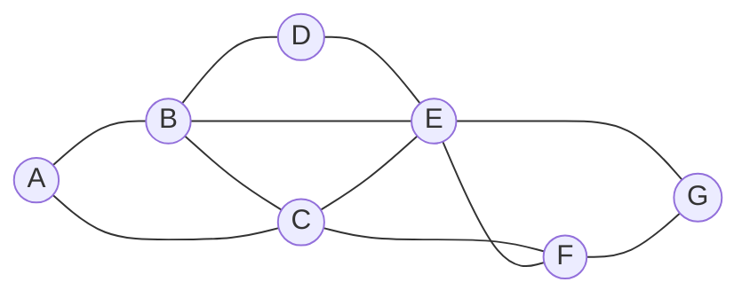

## Idea

- Select the variable that has the highest degree
- Relies on the degrees of variables
	- A degree is how many arcs connect a variable to other variables
- By choosing the variable with the highest degree, with one assignment, we constrain multiple other variables, speeding the algorithm’s process

## Limitations

- Not always applicable
- Especially when multiple variables have the same highest degree

## Examples

> Using example from Constraint Satisfaction for explanation



> ```
> A: {Mon, Tue, Wed}
> B: {Mon, Tue, Wed}
> C: {Mon, Tue, Wed}
> D: {Mon, Tue, Wed}
> E: {Mon, Tue, Wed}
> F: {Mon, Tue, Wed}
> G: {Mon, Tue, Wed}
> ```

- All the variables above have domains of the same size
- Pick a domain with the highest degree, which would be `E`
