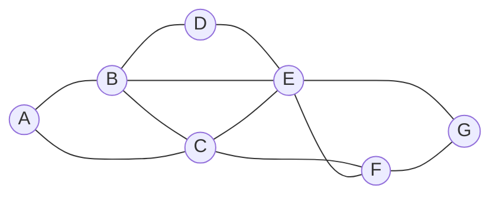

## Idea

- Return variables in order by number of choices that are ruled out for neighbouring variables
- Select the value that will constrain the least other variables
	- While in the [[Degree]] heuristic we wanted to use the variable that is more likely to constrain other variables
	- Here we want this variable to place the least constraints on other variables
- Locate what could be the largest potential source of trouble (the variable with the highest degree)
- Render it the least troublesome that we can (assign the least constraining value to it)

## Examples

> Using example from Constraint Satisfaction for explanation



> ```
> A: Mon
> B: {Mon, Tue, Wed}
> C: {Tue, Wed}
> D: {Mon, Tue, Wed}
> E: {Mon, Tue, Wed}
> F: {Mon, Tue}
> G: Wed
> ```

- Consider `C`, given the current domains and assignment
- If we assign `Tue` to it, we will put a constraint on all of `B`, `E`, and `F`
- If we assign `Wed` to it, we will put a constraint only on `B` and `E`
- Therefore, it is probably better to go with `Wed`