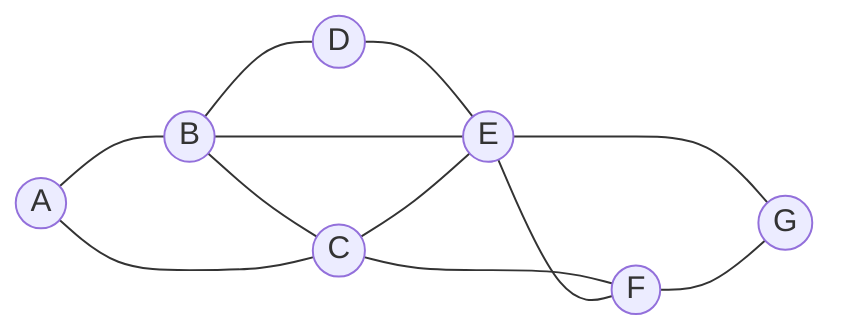

---
aliases:
  - MRV
---

## Idea

- Select the variable that has the smallest domaon
- If a variable’s domain was constricted by [[inference]], and now it has only one value left (or even if it’s two values), then by making this assignment we will reduce the number of backtracks we might need to do later
- We will have to make this assignment sooner or later, since it’s inferred from enforcing arc-consistency
- If this assignment brings to failure, it is better to find out about it as soon as possible and not backtrack later

## Limitations

- Not always applicable
- Especially when multiple variables have the same least number of values in their domain

## Examples

> Using [[Constraint Satisfaction#Examples|example from Constraint Satisfaction]] for explanation



> ```
> A: Mon
> B: Tue
> C: {Wed}
> D: {Mon, Wed}
> E: {Mon, Tue, Wed}
> F: {Mon, Tue, Wed}
> G: {Mon, Tue, Wed}
> ```

- After having narrowed down the domains of variables given the current assignment
- Choose variable `C` next and assign the value `Wed` to it
