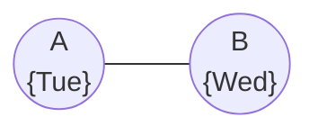

## Definition

- When all the values in a variable’s domain satisfy the variable’s [[Binary Constraint|binary constraints]]
- To make $X$ arc-consistent with respect to $Y$, remove elements from $X$’s domain until every choice for $X$ has a possible choice for $Y$

## Examples



- $\{A\ne Mon,B\ne Tue,B\ne Mon,A\ne B\}$

## Pseudocode

### Revise function

```
Revise(csp, X, Y):
  revised = false
  for x in X.domain:
    if no y in Y.domain satisfies constraint for (X,Y):
      delete x from X.domain
      revised = true
  return revised
```

- Makes `X` arc-consistent with `Y`
- Tracks whether any change was made to `X`’s domain

### AC-3 function

```
AC-3(csp):
  queue = all arcs in csp
  while queue not empty:
    (X, Y) = Dequeue(queue)
    if Revise(csp, X, Y):
      if X.domain.size == 0:
        return false
      for Z in X.neighbors - {Y}:
        Enqueue(queue, (Z, X))
  return true
```

- Makes the whole problem arc-consistent
- If changes were made to `(X, Y)` to make it consistent, further actions are needed
	- If the resulting domain of `X` is empty, it means that this constraint satisfaction problem is unsolvable
	- Otherwise, since `X`’s domain was changed, we need to see if all the arcs associated with `X` are still consistent
- While the algorithm for arc consistency can simplify the problem, it will not necessarily solve it
	- Since it considers binary constraints only
	- It does not how multiple nodes might be interconnected
