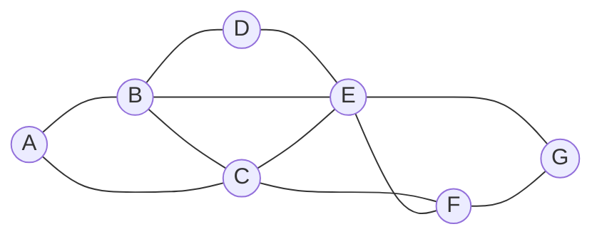

---
aliases:
  - CSP
---

## Definition

- A class of problems where variables need to be assigned values while satisfying some conditions

## Types of constraints

- [[Hard Constraint]]
- [[Soft Constraint]]
- [[Unary Constraint]]
- [[Binary Constraint]]

## Related concepts

- [[Node Consistency]]
- [[Arc Consistency]]

## Properties

- Set of variables $\{X_1,X_2,\dots,X_n\}$
- Set of domains for each variable $\{D_1,D_2,\dots,D_n\}$
- Set of constraints $C$

## Examples

### Exam arrangement

> Student (1..4)
> - Each student is taking three courses
> - Cannot have two exams on the same day

> Course (A..G)
> - Each course has one exam
> - Exam slots: Monday, Tuesday, Wednesday

- Variables: courses $\{A,B,C,\dots,G\}$
- Domains: exam slots $\{Monday,Tuesday,Wednesday\}$ for each variable
- Constraints: which courses can’t be scheduled to have an exam on the same day because the same student is taking them $\{A\ne B,A\ne C,B\ne C,\dots\}$
- Represent constraints as a graph
	- Node: course
	- Edge: connects two courses that can’t be scheduled on the same day

### Soduku

- Variables: empty squares $\{(0,2),(1,1),(1,2),(2,0)\dots\}$
- Domains: numbers $\{1,2,\dots,9\}$ for each variables
- Constraints: the squares that can’t be equal to each other $\{((0,2)\ne(1,1)\ne(1,2)\ne(2,0)),\dots\}$

## CSPs as search problems

### Formulation

- [[Search#Initial State|Initial state]]: empty assignment (no variables)
- [[Search#Actions|Actions]]: add a $\{variable=value\}$ to assignment
- [[Search#Transition model|Transition model]]: shows how adding an assignment changes the assignment
- [[Search#Goal test|Goal test]]: check if all variables assigned and constraints all satisfied
- [[Search#Path cost|Path cost function]]: all paths have same cost

### Approach

- Going about a constraint satisfaction problem naively, as a regular search problem, is massively inefficient
- Can use [[Backtracking Search]] to solve it more efficiently