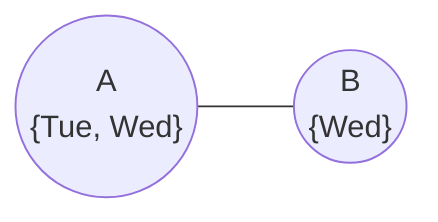

## Definition

- When all the values in a variable’s domain satisfy the variable’s [[Unary Constraint|unary constraints]]

## Examples

```mermaid
flowchart LR
  A(("A<br>{Tue, Wed}"))
  B(("B<br>{Wed}"))

  A---B
```

- $\{A\ne Mon,B\ne Tue,B\ne Mon,A\ne B\}$