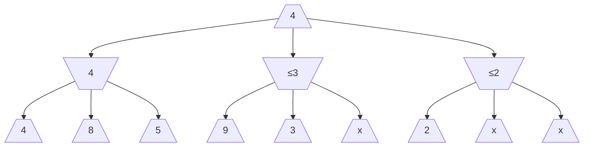

## Characteristics

- Skips some of the recursive computations that are decidedly unfavorable
- No need to further investigate the actions that can bring the opponent to get to a better score than the already established action

## Example

