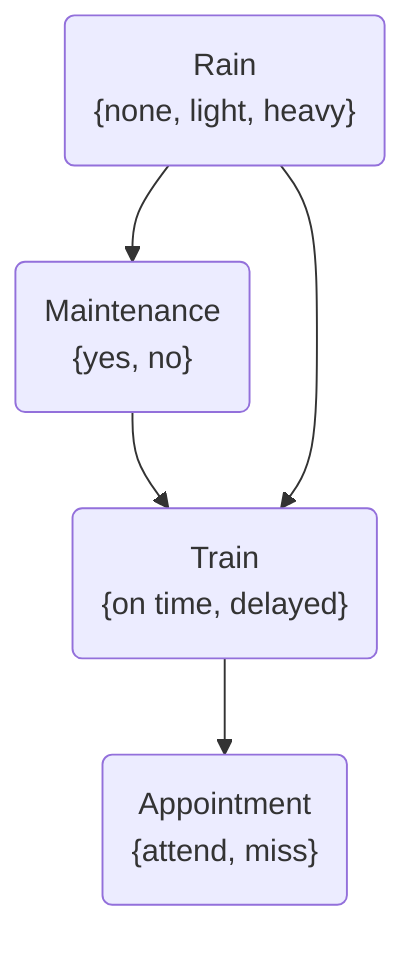

## Definition

- A data structure that represents the dependencies among [[Random Variable|random variables]]

## Properties

- They are directed graphs
- Each node on the graph represent a random variable
- An arrow from X to Y represents that X is a parent of Y
	- The probability distribution of Y depends on the value of X
	- Parents include only direct relations
- Each node X has [[probability distribution]] $P(X|Parents(X))$

## Example

### Rain

|none|light|heavy|
|:-:|:-:|:-:|
|0.7|0.2|0.1|

- `Rain` is the root node
- Can take the values `{none, light, heavy}`
- [[Unconditional probability]]
- Its probability distribution is not reliant on any prior event

### Maintenance

|R|yes|no|
|:-:|:-:|:-:|
|none|0.4|0.6|
|light|0.2|0.8|
|heavy|0.1|0.9|

- Encodes whether there is train track maintenance
- Can take values `{yes, no}`
- `Maintenance` is a child node of `Rain`
- [[Conditional probability]]
- The probability distribution of `Maintenance` is affected by `Rain`

### Train

|R|M|on time|delayed|
|:-:|:-:|:-:|:-:|
|none|yes|0.8|0.2|
|none|no|0.9|0.1|
|light|yes|0.6|0.4|
|light|no|0.7|0.3|
|heavy|yes|0.4|0.6|
|heavy|no|0.5|0.5|

- Encodes whether the train is on time or delayed
- Can take values `{on time, delayed}`
- `Train` is a child node of both `Rain` and `Maintenance`
- [[Conditional probability]]
- The probability distribution of `Train` is affected by both `Rain` and `Maintenance`

### Appointment

|T|attend|miss|
|:-:|:-:|:-:|
|on time|0.9|0.1|
|delayed|0.6|0.4|

- Represents whether we attend our appointment
- Can take values `{attend, miss}`
- `Appointment` is a child node of `Train`
- [[Conditional probability]]
- The probability distribution of `Appointment` is affected by `Train`
	- `Maintenance` affects `Train`, and `Train` affects `Appointment`
	- However, in the end, what directly affects `Appointment` is `Train`
	- E.g.  if the train came on time, it could be heavy rain and track maintenance, but that has no effect over whether we made it to our appointment

### Computation

$$
\begin{aligned}
P(light,no,delayed,miss)&=P(light)P(no|light)P(delyaed|light,no)P(miss|delayed)\\
&=(0.2)(0.8)(0.3)(0.4)\\
&=0.0192
\end{aligned}
$$

> $P(light,no,delayed,miss)$: the [[joint probability]] of missing the meeting when the train was delayed on a day with no maintenance and light rain