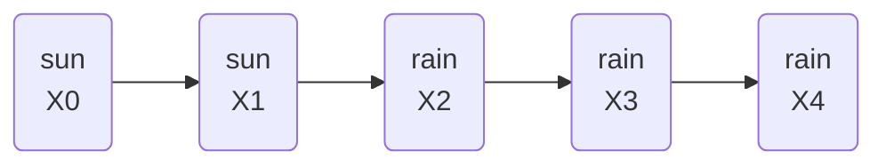

## Definition

- A sequence of [[Random Variable|random variables]] where the distribution of each variable follows the [[Markov Assumption|Markov assumption]]

## Transition model

- Specifies the the [[Probability Distribution|probability distributions]] of the next event based on the possible values of the current event

## Algorithm

1. Start with any value of the variable
2. Sample the next node based on the probabilities in transition model
3. Repeat step 2

## Example

### Transition model

||sun|rain|
|:-:|:-:|:-:|
|sun|0.8|0.2|
|rain|0.3|0.7|

### Markov chain



## Code examples

```python
from pomegranate import *

# Define starting probabilities
start = DiscreteDistribution({
  "sun": 0.5,
  "rain": 0.5
})

# Define transition model
transitions = ConditionalProbabilityTable([
  ["sun", "sun", 0.8],
  ["sun", "rain", 0.2],
  ["rain", "sun", 0.3],
  ["rain", "rain", 0.7]
], [start])

# Create Markov chain
model = MarkovChain([start, transitions])

# Sample 50 states from chain
print(model.sample(50))
```