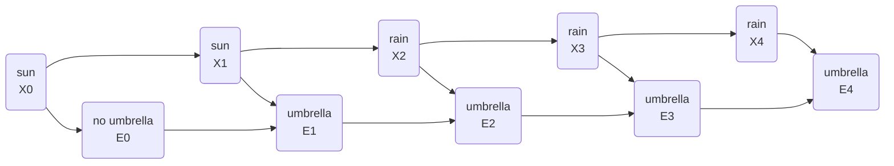

## Definition

- The evidence variable depends only on the corresponding state
	- E.g. we assume that whether people bring umbrellas to the office depends only on the weather in the [[Hidden Markov Model#Examples|example from Hidden Markov Model]]
- Not necessarily reflective of the complete truth
	- E.g. more conscientious, rain-averse people might take an umbrella with them everywhere even when it is sunny
	- If we knew everyone’s personalities it would add more data to the model

## Characteristics

- Can be represented in a [[Markov chain]] with two layers
- Top layer: $X$, stands for the hidden state
- Bottom layer: $E$, stands for the evidence, the observations that we have

## Examples



## General tasks

### Filtering

- Given observations from start until now, calculate the [[probability distribution]] for the current state
- E.g. given information on when people bring umbrellas form the start of time until today, we generate a probability distribution for whether it is raining today or not

### Prediction

- Given observations from start until now, calculate the [[probability distribution]] for a future state

### Smoothing

- Given observations from start until now, calculate the [[probability distribution]] for a past state
- E.g. calculating the probability of rain yesterday given that people brought umbrellas today

### Most likely explanation

- Given observations from start until now, calculate most likely sequence of states
- Can be used in processes such as voice recognition
	- Based on multiple waveforms, the AI infers the most likely sequence of words or syllables that brought to these waveform

## Code examples

### Most likely explanation

```python
from pomegranate import *

# Observation model for each state
sun = DiscreteDistribution({
  "umbrella": 0.2,
  "no umbrella": 0.8
})

rain = DiscreteDistribution({
  "umbrella": 0.9,
  "no umbrella": 0.1
})

states = [sun, rain]

# Transition model
transitions = numpy.array(
  [[0.8, 0.2], # Tomorrow's predictions if today = sun
   [0.3, 0.7]] # Tomorrow's predictions if today = rain
)

# Starting probabilities
starts = numpy.array([0.5, 0.5])

# Create the model
model = HiddenMarkovModel.from_matrix(
  transitions, states, starts,
  state_names=["sun", "rain"]
)
model.bake()
```

- Our model has both the sensor model and the transition model
- We need both for the hidden Markov model

### Run model

```python
from model import model

# Observed data
observations = [
  "umbrella",
  "umbrella",
  "no umbrella",
  "umbrella",
  "umbrella",
  "umbrella",
  "umbrella",
  "no umbrella",
  "no umbrella"
]

# Predict underlying states
predictions = model.predict(observations)
for prediction in predictions:
  print(model.states[prediction].name)
```

- We see a sequence of observations of whether people brought umbrellas to the building or not
- Run the model based on this sequence
- Generate the most likely explanation (i.e. the weather sequence that most likely brought to this pattern of observations)
