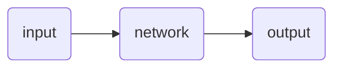

---
aliases:
  - FNN
---

## Definition

```mermaid
flowchart LR
  I(input)
  N(network)
  O(output)

  I-->N-->O
```

- Where input data is provided to the network, which eventually produces some output