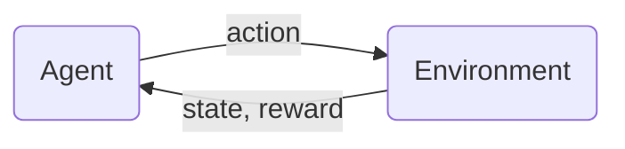

## Characteristics

- The future only depends on the current state, and not on any prior activity

## Model

- **State $s$** (e.g. position of a robot)
- **Action $a$** (e.g. $\leftarrow,\rightarrow$)
- **Reward $R(s)$** (e.g. +100, 50, 0, -50, -100)
- **Discount factor $\gamma$** (e.g. 0.9)
- **Return** $R_1+\gamma{}R_2+\gamma^2R_3+\cdots$
- **Policy $\pi$** (e.g. find $\pi(s)=a$)
- Goal: find a policy $\pi$ that tells what action ($a=\pi(s)$) to take at every state ($s$) so as to maximize the return